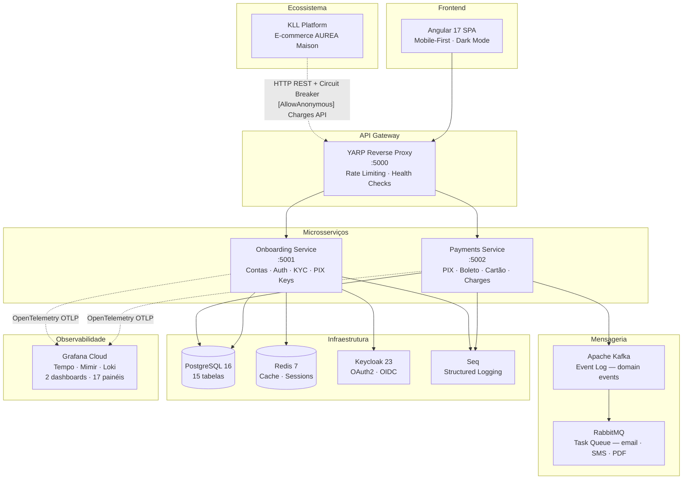
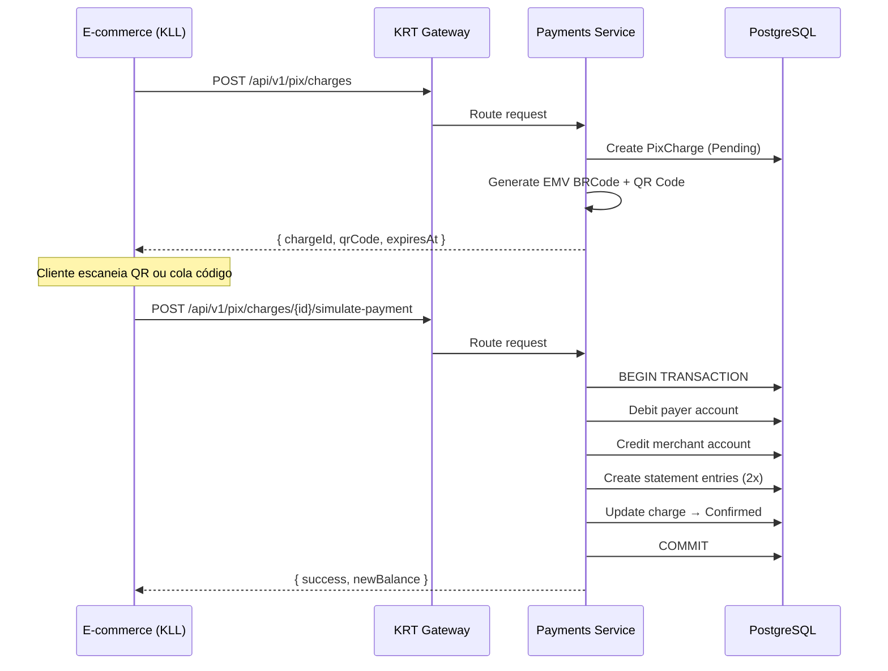
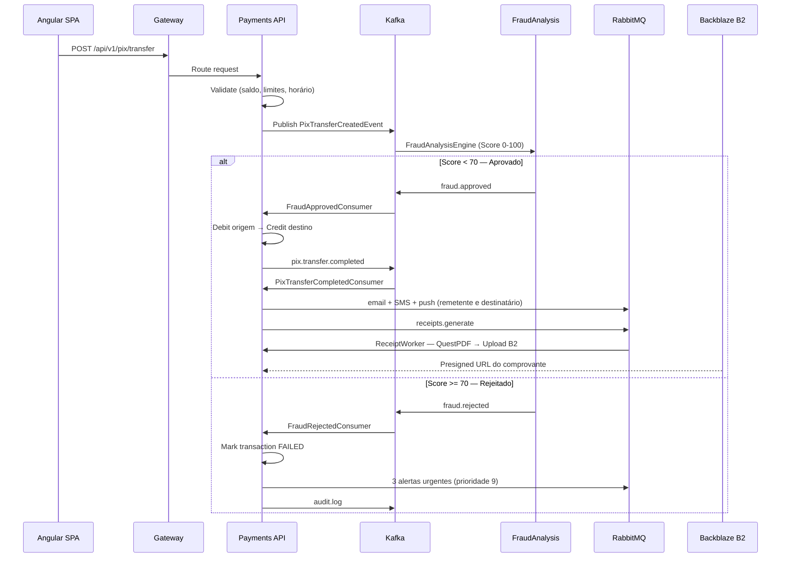
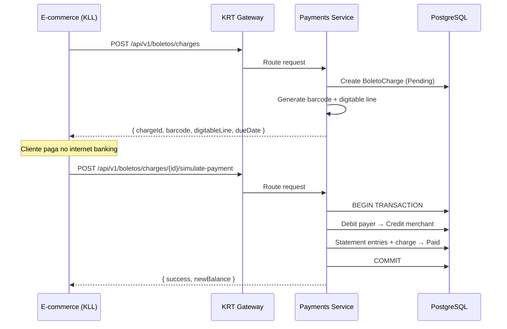
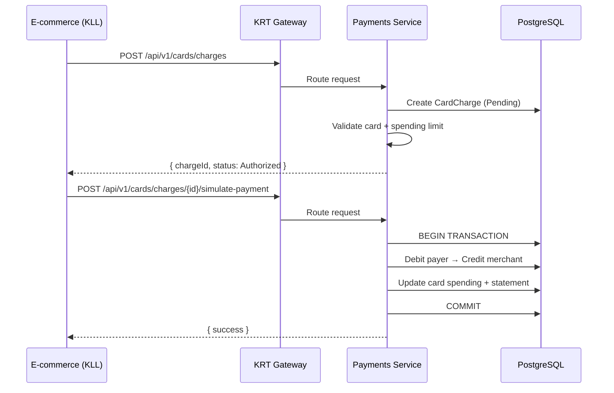
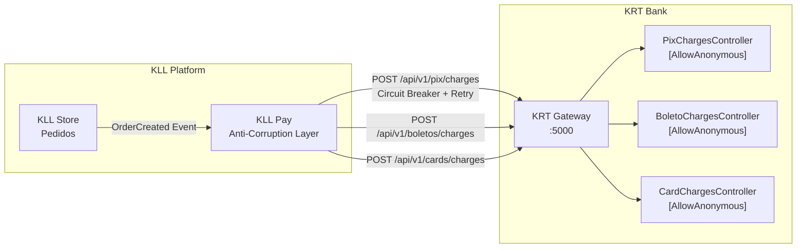

<div align="center">
  <h1>🏦 KRT Bank</h1>
  <p><strong>Plataforma Bancária Digital — PIX, Boleto, Cartão de Crédito</strong></p>
  <p>
    <a href="https://github.com/KlistenesLima/krt-bank/actions/workflows/ci.yml"></a>
    <br/>
    
    
    
    
    
  </p>
  <p><em>⚠️ Projeto Demo — Case de portfólio. Nenhuma transação é real.</em></p>
</div>

---

## Sobre o Projeto

**KRT Bank** é uma plataforma bancária digital completa inspirada em fintechs como Nubank e Inter, construída do zero com microsserviços em **.NET 8** e frontend em **Angular 17**.

O projeto demonstra domínio prático de:

- **Clean Architecture** com separação rigorosa em camadas (Domain → Application → Infrastructure → API)
- **DDD Tático** — Aggregates, Entities, Value Objects, Domain Events e state machines
- **CQRS** com MediatR separando commands de queries
- **Saga Pattern** para orquestração de transações PIX distribuídas
- **Event-Driven Architecture** com Kafka (event log) + RabbitMQ (task queue)
- **Outbox Pattern** garantindo consistência eventual entre banco e mensageria
- **Observabilidade full-stack** — OpenTelemetry exportando traces, métricas e logs para Grafana Cloud

> 📦 **Parte do Ecossistema:** O KRT Bank integra-se com a [KLL Platform](https://github.com/KlistenesLima/kll-platform) (e-commerce de joias de luxo), fornecendo processamento real de pagamentos via PIX, Boleto e Cartão através de um Anti-Corruption Layer com Circuit Breaker.

---

## Funcionalidades

- ✅ Abertura de conta e KYC (documento + selfie)
- ✅ Autenticação via Keycloak (OAuth2 / OpenID Connect)
- ✅ Transferência PIX (CPF, Email, Celular, Chave Aleatória)
- ✅ PIX Copia e Cola (BRCode EMV parser)
- ✅ Geração e pagamento de Boleto
- ✅ Cartão de Crédito Virtual (Luhn, CVV rotativo, limites)
- ✅ Extrato bancário em tempo real
- ✅ Operações bancárias atômicas (débito/crédito/extrato em transação)
- ✅ Chaves PIX (registro, listagem, desativação)
- ✅ Integração com e-commerce (Charges API para KLL Platform)
- ✅ QR Code PIX (padrão EMV/BRCode)
- ✅ Dashboard com saldo, atalhos e extratos
- ✅ Agendamento de PIX (diário, semanal, mensal, trimestral)
- ✅ Simulador de empréstimos (tabelas Price e SAC)
- ✅ Metas financeiras
- ✅ Engine de análise de fraude (score 0-100)
- ✅ Comprovantes PDF profissionais (QuestPDF → Backblaze B2)
- ✅ Notificações em tempo real (SignalR)

---

## Arquitetura



---

## Tech Stack

| Camada | Tecnologias |
|--------|-------------|
| **Frontend** | Angular 17 (Standalone), TypeScript 5.2, Angular Material 17, Chart.js, SignalR, RxJS |
| **Backend** | .NET 8, ASP.NET Core Web API, C# 12, MediatR 12.4, FluentValidation 11 |
| **Arquitetura** | Clean Architecture, DDD, CQRS, Saga Pattern, Outbox Pattern, YARP Gateway |
| **Banco de Dados** | PostgreSQL 16 (principal), Redis 7 (cache/sessões) |
| **Mensageria** | Apache Kafka 7.5 (domain events) + RabbitMQ 3 (task queue) — Dual Messaging |
| **Autenticação** | Keycloak 23 (OAuth2 / OpenID Connect), JWT RS256 |
| **Observabilidade** | OpenTelemetry → Grafana Cloud (Tempo + Mimir + Loki), Serilog → Seq |
| **Resiliência** | Polly (Circuit Breaker, Retry com Backoff Exponencial) |
| **PDF** | QuestPDF — comprovantes bancários profissionais |
| **Cloud Storage** | Backblaze B2 (S3-compatible) — comprovantes PIX |
| **Containerização** | Docker, Docker Compose (11 containers) |
| **Testes** | xUnit, Moq, FluentAssertions, Cypress (E2E) |

---

## Estrutura do Projeto

```
krt-bank/
├── src/
│   ├── BuildingBlocks/                          # Shared Kernel
│   │   ├── KRT.BuildingBlocks.Domain/           # Entity, AggregateRoot, Value Objects, Exceptions
│   │   ├── KRT.BuildingBlocks.Infrastructure/   # OpenTelemetry, KrtMetrics (26+ métricas), Persistence
│   │   ├── KRT.BuildingBlocks.EventBus/         # Kafka consumer abstractions (Confluent.Kafka)
│   │   └── KRT.BuildingBlocks.MessageBus/       # RabbitMQ abstractions, QuestPDF, AWS S3 SDK
│   │
│   ├── Services/
│   │   ├── KRT.Gateway/                         # YARP Reverse Proxy — Rate Limiting, Health Checks
│   │   │
│   │   ├── KRT.Onboarding/                      # Contas, Auth, KYC, PIX Keys
│   │   │   ├── KRT.Onboarding.Domain/           #   Account (Aggregate), PixKey entities
│   │   │   ├── KRT.Onboarding.Application/      #   MediatR Handlers (CQRS)
│   │   │   ├── KRT.Onboarding.Infra.Data/       #   EF Core + PostgreSQL
│   │   │   ├── KRT.Onboarding.Infra.Cache/      #   Redis cache
│   │   │   ├── KRT.Onboarding.Infra.IoC/        #   Dependency Injection
│   │   │   ├── KRT.Onboarding.Infra.MessageQueue/ # RabbitMQ publishers
│   │   │   └── KRT.Onboarding.Api/              #   3 Controllers (Accounts, Auth, PixKeys)
│   │   │
│   │   └── KRT.Payments/                        # PIX, Boleto, Cartão, Charges, Goals, Loans
│   │       ├── KRT.Payments.Domain/             #   15 entidades (PixTransaction, VirtualCard, Boleto...)
│   │       ├── KRT.Payments.Application/        #   4 Kafka Consumers + Commands/Queries
│   │       │   └── Consumers/
│   │       │       ├── FraudApprovedConsumer     #     Saga: débito → crédito → comprovante
│   │       │       ├── FraudRejectedConsumer     #     Rejeição + alertas urgentes
│   │       │       ├── PixTransferCompletedConsumer  # Notificações + geração PDF
│   │       │       └── AuditLogConsumer          #     Audit trail regulatório
│   │       ├── KRT.Payments.Infra.Data/         #   EF Core, Repositories, Unit of Work
│   │       ├── KRT.Payments.Infra.Http/         #   HttpClient configurations
│   │       ├── KRT.Payments.Infra.IoC/          #   DI container setup
│   │       └── KRT.Payments.Api/                #   21 Controllers + SignalR Hubs
│   │           └── Controllers/
│   │               ├── PixChargesController      #     [AllowAnonymous] — e-commerce charges
│   │               ├── BoletoChargesController   #     [AllowAnonymous] — e-commerce charges
│   │               ├── CardChargesController     #     [AllowAnonymous] — e-commerce charges
│   │               ├── PixController             #     [Authorize] — transferências P2P
│   │               ├── PixKeysController         #     [Authorize] — gestão de chaves PIX
│   │               ├── StatementController       #     [Authorize] — extrato bancário
│   │               ├── VirtualCardsController    #     [Authorize] — cartões virtuais
│   │               ├── BoletoController          #     [Authorize] — boletos
│   │               ├── GoalsController           #     [Authorize] — metas financeiras
│   │               ├── LoanSimulatorController   #     [Authorize] — simulação Price/SAC
│   │               └── ...                       #     + Dashboard, Admin, Notifications
│   │
│   └── Web/
│       └── KRT.Web/                             # Angular 17 SPA — Standalone Components
│           ├── src/app/
│           │   ├── components/                  #   Dashboard, PIX, Cartões, Extrato
│           │   ├── services/                    #   HTTP clients, Auth interceptors
│           │   └── guards/                      #   Auth guards
│           └── package.json                     #   Angular 17, Material, Chart.js, SignalR
│
├── tests/
│   ├── KRT.UnitTests/                           # 14 arquivos — Domain + Application
│   ├── KRT.IntegrationTests/                    # Repositories + WebApplicationFactory
│   └── k6/                                      # Load testing scripts
│
├── infra/keycloak/                              # Realm configuration
├── .github/workflows/                           # CI/CD pipelines
├── docker-compose.yml                           # 11 containers (produção)
├── docker-compose.prod.yml                      # Deploy production
└── .env.example                                 # Template de variáveis de ambiente
```

---

## Containers

| Container | Imagem | Porta | Função |
|-----------|--------|-------|--------|
| `krt-web` | Angular 17 (custom build) | **4200** | Frontend SPA — interface bancária |
| `krt-gateway` | .NET 8 (YARP) | **5000** | API Gateway — roteamento, rate limiting |
| `krt-onboarding-api` | .NET 8 | **5001** | Microsserviço de Onboarding (Contas, Auth, KYC) |
| `krt-payments-api` | .NET 8 | **5002** | Microsserviço de Pagamentos (PIX, Boleto, Cartão) |
| `krt-postgres` | postgres:16-alpine | **5433** | Banco de dados principal (15 tabelas) |
| `krt-redis` | redis:7-alpine | **6380** | Cache de contas e sessões |
| `krt-kafka` | confluentinc/cp-kafka:7.5.0 | **9092** | Event log — domain events imutáveis |
| `krt-zookeeper` | confluentinc/cp-zookeeper:7.5.0 | **32181** | Coordenação do Kafka |
| `krt-rabbitmq` | rabbitmq:3-management | **5672 / 15680** | Task queue — email, SMS, PDF |
| `krt-keycloak` | keycloak:23.0 | **8080** | Identity Provider (OAuth2 / OIDC) |
| `krt-seq` | datalust/seq:2024.1 | **8081** | Dashboard de logs estruturados |

---

## Fluxos de Pagamento

### Fluxo PIX — Charge via E-commerce



### Fluxo PIX — Transferência P2P com Saga



### Fluxo Boleto



### Fluxo Cartão de Crédito



---

## Integração com o Ecossistema

O KRT Bank funciona como o **motor financeiro** do ecossistema, recebendo charges da [KLL Platform](https://github.com/KlistenesLima/kll-platform) via Anti-Corruption Layer:



**Mecanismos de resiliência:**

| Mecanismo | Implementação |
|-----------|---------------|
| **Health Check** | `GET /health` — KLL Pay verifica saúde do KRT Bank antes de cada operação |
| **Circuit Breaker** | Polly — abre circuito após 3 falhas, aguarda 30s antes de tentar novamente |
| **Retry com Backoff** | 3 tentativas com delay exponencial (1s, 2s, 4s) |
| **Fallback** | Quando KRT Bank está offline, KLL Pay oferece "Cartão Simulado" como alternativa |
| **Endpoints públicos** | Controllers de charges usam `[AllowAnonymous]` para comunicação service-to-service |

> 📝 **Melhoria futura:** Substituir `[AllowAnonymous]` por autenticação service-to-service com OAuth2 Client Credentials.

---

## Observabilidade — OpenTelemetry + Grafana Cloud

Telemetria completa exportada via **OTLP** para Grafana Cloud com **26+ métricas customizadas**:

| Sinal | Destino | Instrumentação |
|-------|---------|----------------|
| **Traces** | Grafana Tempo | ASP.NET Core, HttpClient, Entity Framework Core |
| **Métricas** | Grafana Mimir | 26+ métricas custom via `KrtMetrics.cs` |
| **Logs** | Grafana Loki | Serilog structured logging + Seq local |

**Métricas customizadas (amostra):**

| Meter | Métrica | Tipo |
|-------|---------|------|
| `KRT.Bank.Pix` | `krt.pix.transactions.completed` | Counter |
| `KRT.Bank.Pix` | `krt.pix.transactions.failed` | Counter |
| `KRT.Bank.Pix` | `krt.pix.transaction.duration` | Histogram (ms) |
| `KRT.Bank.Fraud` | `krt.fraud.detected` | Counter |
| `KRT.Bank.Kafka` | `krt.kafka.messages.consumed` | Counter (por tópico) |
| `KRT.Bank.Kafka` | `krt.kafka.consumer.latency` | Histogram (ms) |
| `KRT.Bank.Storage` | `krt.b2.uploads.completed` | Counter |

**2 Dashboards Grafana Cloud** com **17 painéis** (success rate, latência p50/p95/p99, throughput Kafka, fraud detection, B2 uploads).

---

## Dual Messaging: Kafka + RabbitMQ

| Aspecto | Apache Kafka | RabbitMQ |
|---------|-------------|----------|
| **Papel** | Event Log (fatos imutáveis) | Task Queue (tarefas executáveis) |
| **Uso no KRT** | PIX created, fraud result, audit log | Email, SMS, push, geração de comprovante |
| **Garantia** | Log imutável, replay, auditoria BACEN | Exactly-once delivery, DLQ, retry |
| **Tópicos/Filas** | `fraud.approved`, `fraud.rejected`, `pix.transfer.completed`, `audit.log` | `email`, `sms`, `push`, `receipts.generate` |

---

## Como Executar

```bash
# 1. Clone o repositório
git clone https://github.com/KlistenesLima/krt-bank.git
cd krt-bank

# 2. Configure as variáveis de ambiente
cp .env.example .env
# Edite o .env com suas credenciais

# 3. Suba todos os containers
docker compose up -d

# 4. Verifique se está tudo rodando
docker ps --format "table {{.Names}}\t{{.Status}}\t{{.Ports}}"

# 5. Acesse
# Angular App:   http://localhost:4200
# Gateway API:   http://localhost:5000
# Swagger ONB:   http://localhost:5001/swagger
# Swagger PAY:   http://localhost:5002/swagger
# Keycloak:      http://localhost:8080   (admin/admin)
# RabbitMQ:      http://localhost:15680  (guest/guest)
# Seq Logs:      http://localhost:8081
```

---

## Testes

```bash
dotnet test --configuration Release    # 145 testes, 0 falhas
```

| Tipo | Framework | Escopo |
|------|-----------|--------|
| **Unit** | xUnit + Moq + FluentAssertions | Domain (state machines, value objects), Application (handlers) |
| **Integration** | xUnit + WebApplicationFactory | Repositories, API endpoints |
| **E2E** | Cypress | Fluxos completos (login → PIX → dashboard) |
| **Load** | k6 | Performance e throughput dos endpoints |

---

## Roadmap

- [ ] PIX Copia e Cola — integração no frontend Angular
- [ ] Cartão de Crédito — lógica completa de limite e fatura mensal
- [ ] Autenticação Service-to-Service (OAuth2 Client Credentials)
- [ ] Deploy cloud (Oracle Cloud Free Tier / AWS)
- [x] CI/CD com GitHub Actions (build + testes)

---

## Autor

<div align="center">
  <strong>Klístenes Lima</strong><br/>
  Senior .NET Software Engineer<br/><br/>
  <a href="https://linkedin.com/in/klisteneslima">
    
  </a>
  <a href="https://github.com/KlistenesLima">
    
  </a>
</div>

---

## Licença

Este projeto está licenciado sob a licença MIT. Veja o arquivo [LICENSE](LICENSE) para mais detalhes.

---

<div align="center">
  <sub>
    <strong>KRT Bank</strong> — Plataforma bancária digital completa<br/>
    .NET 8 · Angular 17 · Kafka · RabbitMQ · PostgreSQL · Docker · Grafana Cloud<br/><br/>
    Parte do ecossistema integrado com <a href="https://github.com/KlistenesLima/kll-platform">KLL Platform</a>
  </sub>
</div>
